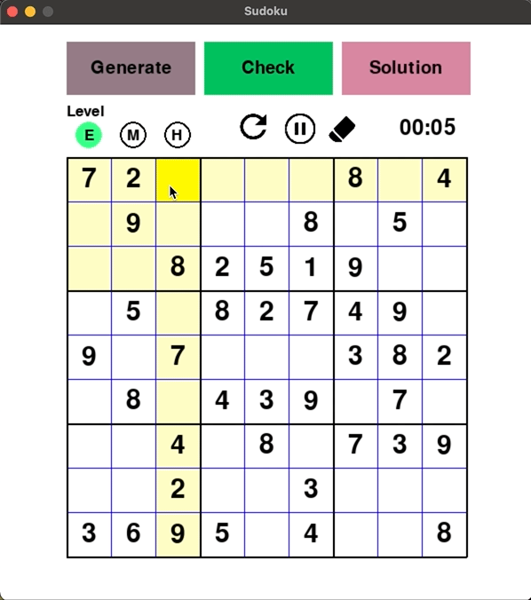
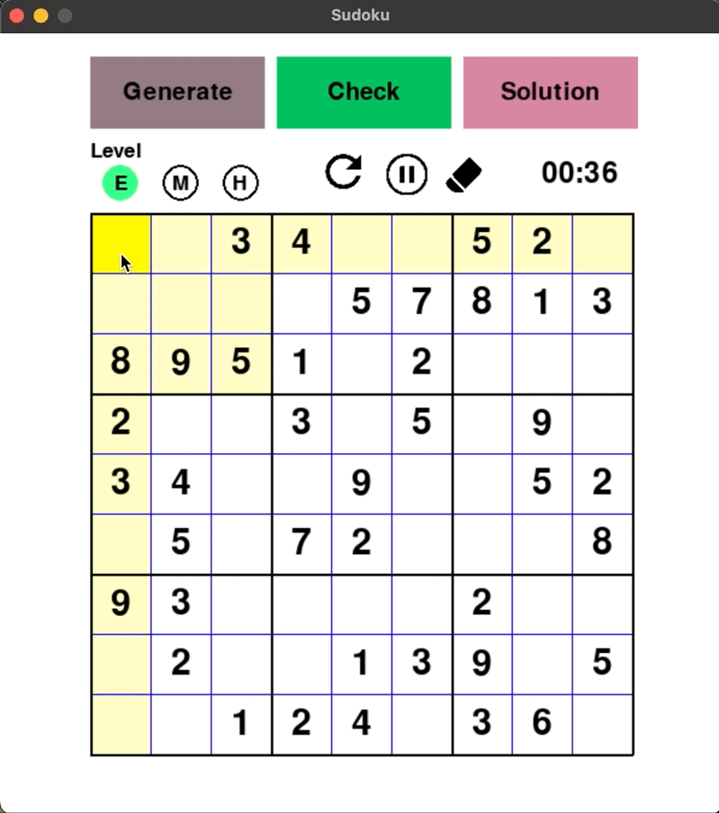
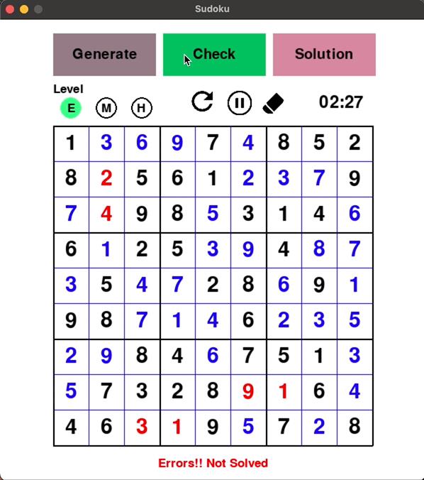
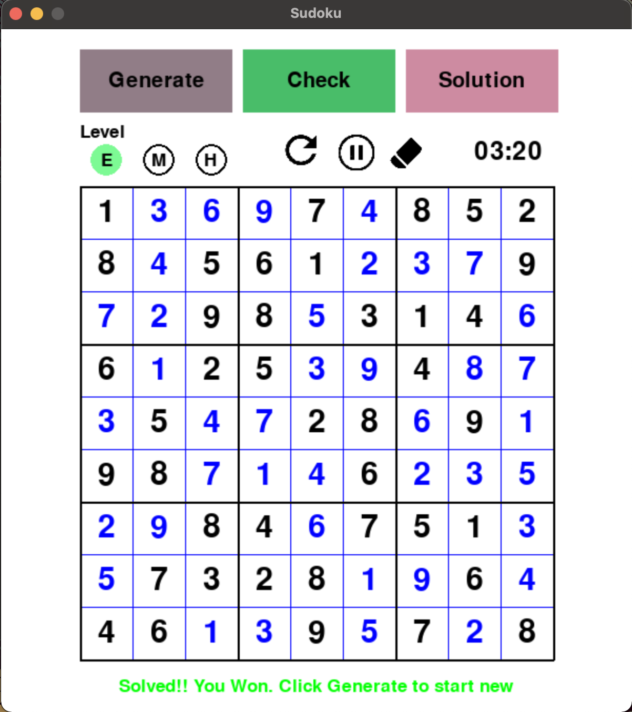

# Sudoku

A sudoku Game created using python.
It requires internet connection as it depends on an API to generate random boards. 
The user can play 3 different levels against time. And if the user wishes to see the solution, they can see the solution as well.
The game is built using pygame.
For solving the sudoku board, backtracking algorithm is used.

HOT keys :-

KEYS | FUNCTION
-----|----------
**Q** | quit program
**SPACE** | confirm the selected operation
**ESC** | reject the selected operation
**1 to 9** | To put the number in the selected cell of sudoku board

| Plugin | README |
| ------ | ------ |
| Dropbox | [plugins/dropbox/README.md][PlDb] |
| GitHub | [plugins/github/README.md][PlGh] |
| Google Drive | [plugins/googledrive/README.md][PlGd] |
| OneDrive | [plugins/onedrive/README.md][PlOd] |
| Medium | [plugins/medium/README.md][PlMe] |
| Google Analytics | [plugins/googleanalytics/README.md][PlGa] |

## Some of the Functionalities

* __The User can click in generate to generate random Sudoku puzzle along with different difficulties__

__The User can change the difficulty level__
* E - Easy
* M - Medium
* H - Hard

 
 

* __The game can be paused__

 
 

* __If an unfilled board is checked it shows "All cells are not Filled"__

 
 

* __If all the cells are filled and the puzzle is not solver it hightlights the error in red color__

 
 

* __If the puzzle is solved it shows the puzzle was solved__

